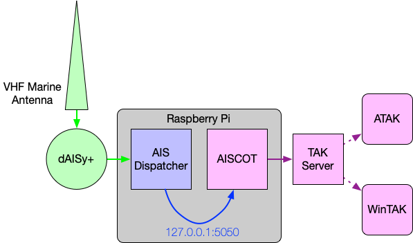

The following diagram shows an example setup of AISCOT utilizing a dAISy+ AIS receiver 
with an outboard Marine VHF antenna, a Raspberry Pi running aisdispatcher and AISCOT, 
forwarding COT to a TAK Server and WinTAK & ATAK clients. (OV-1)





## Run on a Raspberry Pi

This example configuration can run along-side the dump1090 software on the same computer, or on computers connected over an IP network (i.e. A remote Raspberry Pi running dump1090). 

ADS-B data is transformed into TAK data and forwarded to our TAK Server over TCP port ``8087``.

```ini
[adsbcot]
COT_URL = tcp://takserver.example.com:8087
FEED_URL = tcp://sensor.example.com:30003
```

### Usage

1. Add the configuration text to a configuration file named: ``adsbcot.ini``
2. Use the configuration file when starting ADSBCOT: ``adsbcot -c adsbcot.ini``
> Ensure you know the full path to your configuration file.

## Forward to ATAK

This example configuration can run along-side the dump1090 software on the same computer, or on computers connected over an IP network (i.e. A remote Raspberry Pi running dump1090). 

ADS-B data is transformed into TAK data and forwarded to our ATAK Mesh SA Multicast Network.

```ini
[adsbcot]
COT_URL = udp+wo://239.2.3.1:6969
FEED_URL = tcp://10.1.2.24:30003
```

### Usage

1. Add the configuration text to a configuration file named: ``adsbcot.ini``
2. Use the configuration file when starting ADSBCOT: ``adsbcot -c adsbcot.ini``
> Ensure you know the full path to your configuration file.

## Use aircraft JSON API

This example configuration can run along-side the dump1090 software on the same computer, or on computers connected over an IP network (i.e. A remote Raspberry Pi running dump1090). 

ADS-B data is read from the dump1090 aircraft JSON API URL every 10 seconds, and is transformed into TAK data. From there it is forwarded to our TAK Server over TLS port ``8089`` using client certificates.

```ini
[adsbcot]
PYTAK_TLS_CLIENT_CERT = /etc/my_client_cert.pem
COT_URL = tls://takserver.example.com:8089
FEED_URL = http://piaware.local:8080/data/aircraft.json
POLL_INTERVAL = 10
```

### Usage

1. Add the configuration text to a configuration file named: ``adsbcot.ini``
2. Use the configuration file when starting ADSBCOT: ``adsbcot -c adsbcot.ini``
> Ensure you know the full path to your configuration file.


## Using environment variables

```bash linenums="1"
export COT_URL="udp://10.9.8.7:8087"
export FEED_URL="tcp+raw://127.0.0.1:30002"
adsbcot
```
